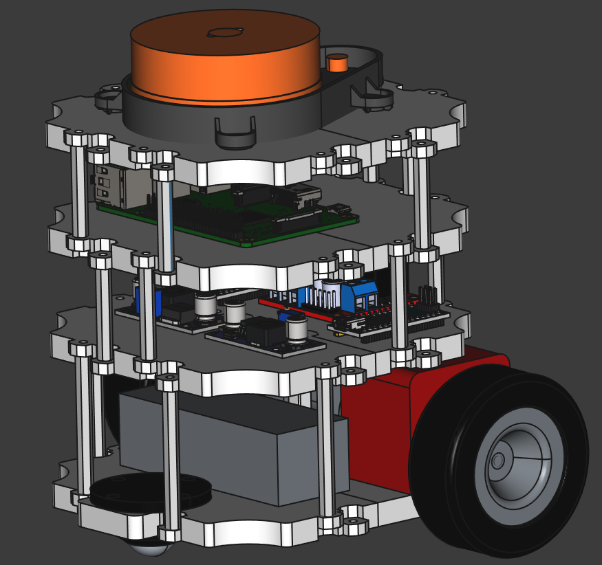

## Реализация по мотивам проекта [TurtleBot3 Burger](https://www.turtlebot.com/) 

### Project goal: bot implementation on commodity hardware

The project uses widely available and cheaper components. 
Created custom waffle 3D models for printing at home with the ability to adapt to various 
components. Source files in FreeCAD format are available.

### Цель проекта: реализация бота с использованием более доступного железа

В проекте используются широко доступные и более дешевые компоненты. 
Реализованы модели для 3D печати в домашних условиях с возможностью адаптации 
под различные компоненты. Для всех деталей доступны исходники в 
формате FreeCAD.

